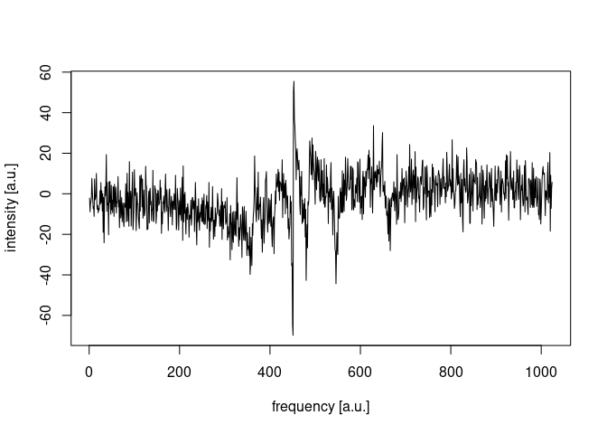
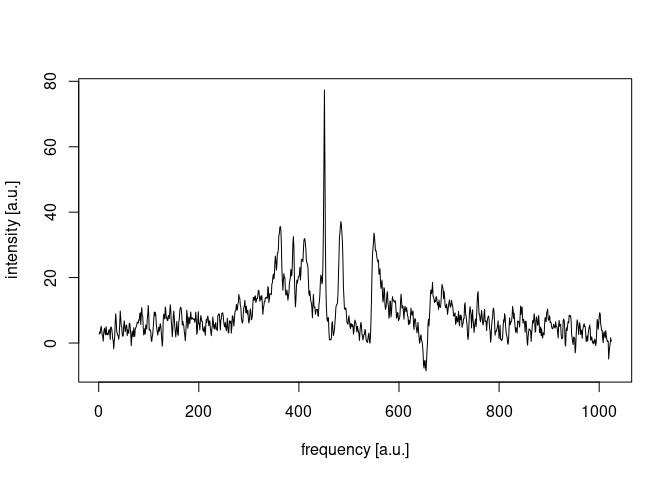

Minimal NIfTI MRS reader example for R
================

The purpose of this document is to demonstrate how [NIfTI
MRS](https://docs.google.com/document/d/1tC4ugzGUPLoqHRGrWvOcGCuCh_Dogx_uu0cxKub0EsM/edit?usp=sharing)
may be imported into the [`R`](https://www.r-project.org/) programming
language, and perform basic processing steps with just few lines of
code. Whilst dedicated MRS analysis packages, such as
[`spant`](https://martin3141.github.io/spant/), are recommended for
typical MRS analysis tasks in [`R`](https://www.r-project.org/), this
example code is provided to aid software developers interested in
writing their own tools to process NIfTI MRS files.

Firstly we download an example file, available from the [NIfTI MRS
github repository](https://github.com/wexeee/mrs_nifti_standard), and
load the excellent [`RNifti`](https://github.com/jonclayden/RNifti)
library to read the data:

``` r
fname <- "csi.nii.gz"
if (!file.exists(fname)) {
  download.file("https://dl.dropboxusercontent.com/s/g5jwikq7btikdtt/csi.nii.gz?dl=0", mode = "wb", fname)
}
library(RNifti)
nifti_mrs <- readNifti(fname)
```

We might be interested to know the FID sampling frequency,

``` r
1 / pixdim(nifti_mrs)[4]
```

    ## [1] 4000

and spatial transform to map our MRS data onto other MR images:

``` r
xform(nifti_mrs)
```

    ##         [,1]    [,2] [,3]      [,4]
    ## [1,] -14.375   0.000  0.0  124.0140
    ## [2,]   0.000 -14.375  0.0  138.4644
    ## [3,]   0.000   0.000 12.5 -101.4674
    ## [4,]   0.000   0.000  0.0    1.0000
    ## attr(,"code")
    ## [1] 2

a full header listing may also be output for inspection:

``` r
niftiHeader(nifti_mrs)
```

    ## NIfTI-2 header
    ##     sizeof_hdr: 540
    ##       dim_info: 0
    ##            dim: 4  16  16  16  1024  1  1  1
    ##      intent_p1: 0
    ##      intent_p2: 0
    ##      intent_p3: 0
    ##    intent_code: 0 (Unknown)
    ##       datatype: 1792 (COMPLEX128)
    ##         bitpix: 128
    ##    slice_start: 0
    ##         pixdim: 1.00000  14.37500  14.37500  12.50000  0.00025  0.00000  0.00000  0.00000
    ##     vox_offset: 928
    ##      scl_slope: 0
    ##      scl_inter: 0
    ##      slice_end: 0
    ##     slice_code: 0 (Unknown)
    ##     xyzt_units: 0
    ##        cal_max: 0
    ##        cal_min: 0
    ## slice_duration: 0
    ##        toffset: 0
    ##        descrip: 
    ##       aux_file: 
    ##     qform_code: 2 (Aligned Anat)
    ##     sform_code: 2 (Aligned Anat)
    ##      quatern_b: 0
    ##      quatern_c: 0
    ##      quatern_d: 1
    ##      qoffset_x: 124.014
    ##      qoffset_y: 138.4644
    ##      qoffset_z: -101.4674
    ##         srow_x: -14.375  0.000  0.000  124.014
    ##         srow_y: 0.0000  -14.3750  0.0000  138.4644
    ##         srow_z: 0.0000  0.0000  12.5000  -101.4674
    ##    intent_name: mrs_v0_2
    ##          magic: n+2

MRS data processing requires information beyond what is defined in the
standard header, therefore we make use of the NIfTI MRS header extension
(ecode 44), where additional parameters are stored in JSON format. Here
we load the [`jsonlite`](https://arxiv.org/abs/1403.2805) library and
output the first few items:

``` r
ext_str  <- extension(nifti_mrs, 44, "character")
library(jsonlite)
ext_json <- fromJSON(ext_str)
head(ext_json)
```

    ## $SpectrometerFrequency
    ## [1] 49.86013
    ## 
    ## $ResonantNucleus
    ## [1] "31P"
    ## 
    ## $EchoTime
    ## [1] 0.0023
    ## 
    ## $RepetitionTime
    ## [1] 1
    ## 
    ## $InversionTime
    ## [1] 0
    ## 
    ## $MixingTime
    ## NULL

To plot a spectrum we simply treat `nifti_mrs` as a multidimensional
array, with the first three dimensions being the x, y and z voxel
coordinates (8, 8, 12) and the fourth dimension as the FID. Once the FID
has been extracted, we perform a Fourier transform and shift the data
with
[`pracma::fftshift`](https://cran.r-project.org/web/packages/pracma/index.html)
to show 0 Hz in the centre of the spectrum:

``` r
library(pracma)
fid  <- nifti_mrs[8, 8, 12, ]
spec <- fftshift(fft(fid))
plot(Re(spec), type = "l", xlab = "frequency [a.u.]", ylab = "intensity [a.u.]")
```

<!-- -->

Finally, basic phasing and line-broadening steps may be performed to aid
visual interpretation:

``` r
fid_proc  <- fid * exp(-2i - 5e-3 * seq(0, dim(nifti_mrs)[4] - 1))
spec_proc <- fftshift(fft(fid_proc))
plot(Re(spec_proc), type = "l", xlab = "frequency [a.u.]", ylab = "intensity [a.u.]")
```

<!-- -->
